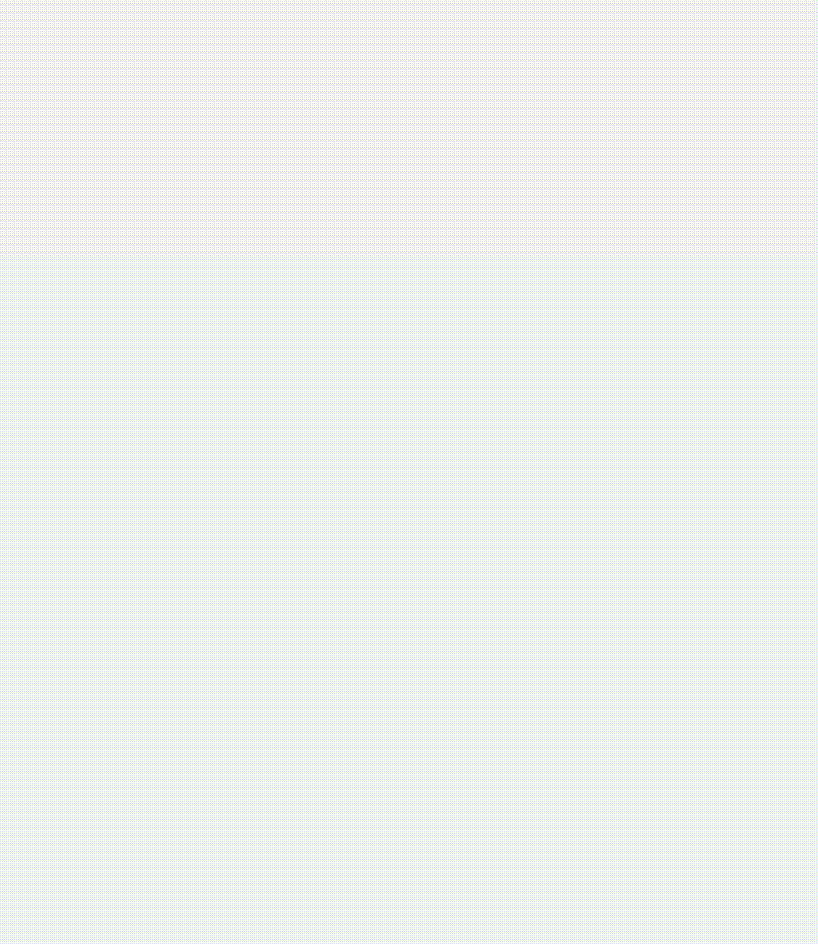

<p align="center">
  
  
  
  
  
</p>

<h1 align="center">CeregoScrapperBot</h1>
<p align="center">
  <b>An automation bot to solve quizzes, collect questions, and generate answer key PDFs!</b>
</p>

<p align="center">
  
</p>

---

## 🚀 Features

- Automatically solves quizzes and records answers
- Collects questions, choices, and correct answers from all quizzes
- Generates PDF answer keys using collected data
- Fully automated end-to-end script workflow
- Secure and flexible user management via .env file

---

## ⚡️ User Settings

Edit these variables at the top of the script to control quiz selection and repeat behavior:

```python
# === USER SETTINGS ===
QUIZ_SELECTION = [5, 8]    # "all" or [2, 5, 8], 1-based quiz numbers
REPEAT_COUNT = 2           # How many times each quiz should be solved
```
- **QUIZ_SELECTION:**
  - `"all"`: Solves all quizzes.
  - `[2, 5, 8]`: Solves only the 2nd, 5th, and 8th quizzes (1-based).
- **REPEAT_COUNT:**
  - Specifies how many times each selected quiz will be solved. (e.g., `2` means each selected quiz will be solved twice)

---

## 🛠️ Technologies Used

- **Python 3.10+** 
- **Selenium**
- **ReportLab**
- **python-dotenv** 
- **JSON** 
---

## 📁 Project Structure

```
├── OuizSolver.py
├── QuestionCollector.py
├── SolutionPageCreator.py
├── requirements.txt
├── .env
├── CeregoQuizResults.json
├── img/
    └── demo.gif
```
---

## ⚡️ Browser Support

By default, this project uses **Microsoft Edge** for browser automation.  
If you want to use Google Chrome, simply comment/uncomment the relevant lines in the code as shown below:

```python
from selenium import webdriver
from selenium.webdriver.edge.options import Options  # Default: Edge
# from selenium.webdriver.chrome.options import Options  # For Chrome

options = Options()
options.add_argument("--start-maximized")
driver = webdriver.Edge(options=options)  # Default: Edge
# driver = webdriver.Chrome(options=options)  # For Chrome
```

**Note:**
- Make sure you have the corresponding browser (Edge or Chrome) installed.
- Selenium v4+ will automatically manage the appropriate driver.
- You can switch browsers by changing both the import and the driver initialization lines.

---
---

## ⚙️ Setup & Usage

### 1. Clone the Repository

```bash
git clone https://github.com/yourusername/CeregoScrapperBot.git
cd CeregoScrapperBot
```

### 2. Create and Activate a Virtual Environment

```bash
python -m venv venv
source venv/bin/activate  # (Windows: venv\Scripts\activate)
```

### 3. Install Requirements

```bash
pip install -r requirements.txt
```

### 4. Create and Configure the `.env` File

In the project root, create a file named `.env` and add the following:

```
EMAIL=your_email@example.com
PASSWORD=your_password
DASHBOARD_URL=https://cerego.com/app/nav/v4/dashboard/courses/XXXXXX
```

### 5. Collect All Quiz Questions

```bash
python QuestionCollector.py
```

### 6. Automatically Solve Quizzes

```bash
python OuizSolver.py
```

### 7. Generate PDF Answer Key

```bash
python SolutionPageCreator.py
```

---

## 💡 Tips

- If the web page structure (XPATHs) changes, you may need to update the scripts.
- Valid user credentials are required for quiz platform access.

---
